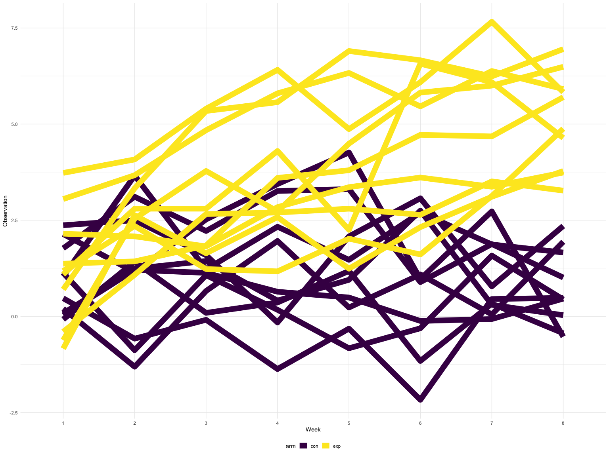

hw5
================
Nihan Gencerliler
11/9/2019

## Problem 1

``` r
set.seed(10)

iris_with_missing = iris %>% 
  map_df(~replace(.x, sample(1:150, 20), NA)) %>%
  mutate(Species = as.character(Species))

replace_missing = function(original_values) {
  if (is.numeric(original_values))
   {new_values=replace_na(original_values, mean(original_values,na.rm = TRUE))}
  else 
  {new_values=replace_na(original_values, "virginica")}
  new_values
}

iris_without_missing = map_dfr(iris_with_missing, replace_missing)

head(iris_without_missing)
```

    ## # A tibble: 6 x 5
    ##   Sepal.Length Sepal.Width Petal.Length Petal.Width Species
    ##          <dbl>       <dbl>        <dbl>       <dbl> <chr>  
    ## 1          5.1         3.5          1.4        0.2  setosa 
    ## 2          4.9         3            1.4        0.2  setosa 
    ## 3          4.7         3.2          1.3        0.2  setosa 
    ## 4          4.6         3.1          1.5        1.19 setosa 
    ## 5          5           3.6          1.4        0.2  setosa 
    ## 6          5.4         3.9          1.7        0.4  setosa

For numeric variables, you should fill in missing values with the mean
of non-missing values For character variables, you should fill in
missing values with “virginica”

## Problem 2

This zip file contains data from a longitudinal study that included a
control arm and an experimental arm. Data for each participant is
included in a separate file, and file names include the subject ID and
arm.

Create a tidy dataframe containing data from all participants, including
the subject ID, arm, and observations over time:

subject ID arm observations time Start with a dataframe containing all
file names; the list.files function will help Iterate over file names
and read in data for each subject using purrr::map and saving the result
as a new variable in the dataframe Tidy the result; manipulate file
names to include control arm and subject ID, make sure weekly
observations are “tidy”, and do any other tidying that’s necessary Make
a spaghetti plot showing observations on each subject over time, and
comment on differences between group

``` r
#create vector of filenames
files_vec=list.files(path = "./data", full.names = TRUE) 
#create dataframe of filenames, subjectID, arm
files_wide=
  
  data_frame(filename=files_vec, subject_ID=str_sub(files_vec,-6,-5), arm=str_sub(files_vec,-10,-8)) %>%
  #create new variable that reads each file into a dataframe and unnest to get each subject's weekly 
  #observations in wide format
  mutate(file_contents = map(filename,read.csv)
  ) %>%
  unnest(file_contents)

#tidy the data to long format in order to create the plot

files_long=
  files_wide %>%
   pivot_longer(week_1:week_8,
               names_to="week",
               names_prefix="week_",
               values_to="observation") %>%
    group_by(week, arm) %>%
    summarize(observation=mean(observation))

files_long %>%
ggplot(aes(x=week,y=observation,group=arm,color=arm)) + geom_line(size=5)
```


