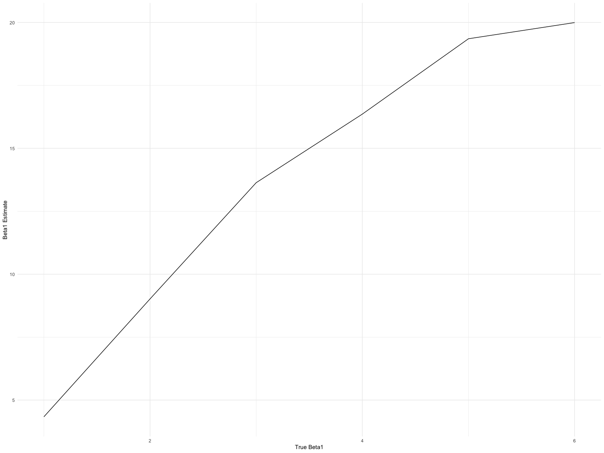

Homework 5
================
Nihan Gencerliler
11/9/2019

## Problem 1

``` r
iris_with_missing = iris %>% 
  map_df(~replace(.x, sample(1:150, 20), NA)) %>%
  mutate(Species = as.character(Species))

#create function to replace missing values 
replace_missing = function(original_values) {
  if (is.numeric(original_values))
   {new_values=replace_na(original_values, mean(original_values,na.rm = TRUE))}
  else 
  {new_values=replace_na(original_values, "virginica")}
  new_values
}
#map function to the iris dataframe, outputting a new df
iris_without_missing = map_dfr(iris_with_missing, replace_missing)
```

The number of missing values in the final df is 0.

## Problem 2

``` r
#create vector of filenames
files_vec=list.files(path = "./data", full.names = TRUE) 
#create dataframe of filenames, subjectID, arm
files_wide=
  
  data_frame(filename=files_vec, subject_ID=str_sub(files_vec,-10,-5), arm=str_sub(files_vec,-10,-8)) %>%
  #create new variable that reads each file into a dataframe and unnest to get each subject's weekly 
  #observations in wide format
  mutate(file_contents = map(filename,read.csv)
  ) %>%
  unnest(file_contents)

#tidy the data to long format in order to create the plot
  files_wide %>%
   pivot_longer(week_1:week_8,
               names_to="week",
               names_prefix="week_",
               values_to="observation") %>%
ggplot(aes(x=week,y=observation,group=subject_ID, color=arm)) + geom_line(size=5) +labs(x="Week",y="Observation")
```


There appears to be an increase in the value of observation for the
experimental group over time while the control group remains relatively
constant.

## Problem 3

``` r
#create function that outputs the p-value and beta1 estimate in a 2x1 dataframe
sim_power = function(n=30, beta0 = 2, beta1) {
  
  sim_data = tibble(
    x = rnorm(n, mean = 1, sd = 1),
    y = beta0 + beta1 * x + rnorm(n, 0, 50)
  )
  
  ls_fit = lm(y ~ x, data = sim_data)
  
  broom::tidy(ls_fit) %>% 
    select(estimate,p.value) %>%
    slice(2:n())
}

#run the above function 10000 times, map this onto 6 different beta values
sim_power_results =
  tibble(beta1list=c(1,2,3,4,5,6)) %>%
  mutate(
    output_lists = map(.x = beta1list, ~rerun(10000, sim_power(beta1 = .x))),
    estimate_dfs = map(output_lists, bind_rows)) %>% 
  select(-output_lists) %>% 
  unnest(estimate_dfs) 
```

Plot showing proportion of times null was rejected for each beta:

``` r
sim_power_results %>%
  group_by(beta1list) %>%
  summarize (power= sum(p.value<0.05)/n()) %>%
  ggplot(aes(x=beta1list,y=power))+geom_line()+labs(x="True Beta1",y="Power")
```


This plot shows that as effect size increases, so does power.

Plot comparing true beta1 to the average beta1 estimate:

``` r
sim_power_results %>%
  filter(p.value<0.05) %>%
  group_by(beta1list) %>%
  summarize(beta1estimate=mean(estimate)) %>%
  ggplot(aes(x=beta1list,y=beta1estimate))+geom_line()+labs(x="True Beta1",y="Beta1 Estimate")
```



When restricted to estimates where the null was rejected, the sample
average for the beta estimate is much higher than the actual beta value.
This is because our small sample size makes it so that the effect size
has to be fairly large in order for us to reject the null.
